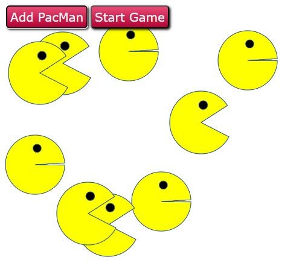

# PacMen-Exercise

## Descripción

PacMen es un proyecto interactivo que simula el movimiento de múltiples PacMan dentro de un área definida. Los PacMan, representados por imágenes intercambiables, se desplazan aleatoriamente, rebotando en los límites del área. Esta aplicación web ofrece una experiencia divertida y dinámica, permitiendo a los usuarios agregar nuevos personajes mientras disfrutan de la animación fluida y el cambio de imágenes.

## Como ejecutar

#### Requisitos Previos:

Un navegador web actualizado, recomendado Google Chrome.

#### Pasos para Ejecutar el Proyecto:

- Descarga todos los archivos del repositorio

- Abrir el archivo _index.html_ en tu navegador web:

  - Haz doble clic en el archivo HTML descargado.
  - O bien, abre tu navegador y arrastra el archivo HTML a la ventana del navegador.

- Interactúa con el proyecto.

- Para finalizar:

  Simplemente cierra la ventana o pestaña del navegador para detener la ejecución del proyecto.

## Mejoras Futuras

1. Controles de Usuario

   - Implementar controles de usuario para pausar, reanudar o detener la animación.

   - Agregar controles para ajustar la velocidad de los PacMan o cambiar la dirección de movimiento.

2. Colisiones mejoradas

   - Implementar colisiones entre los PacMan, generando interacciones o cambios de dirección cuando se encuentren.

3. Elementos interactivos

   - Agregar elementos interactivos en el área de juego, como puntos de comida que los PacMan pueden recolectar.

4. Modos de juego
   - Introducir modos de juego con reglas específicas, como un modo competitivo con puntajes o un modo de supervivencia con obstáculos.

## Licencia

MIT License

Este proyecto está bajo la [Licencia MIT](https://opensource.org/licenses/MIT). Consulta el archivo LICENSE para más detalles
